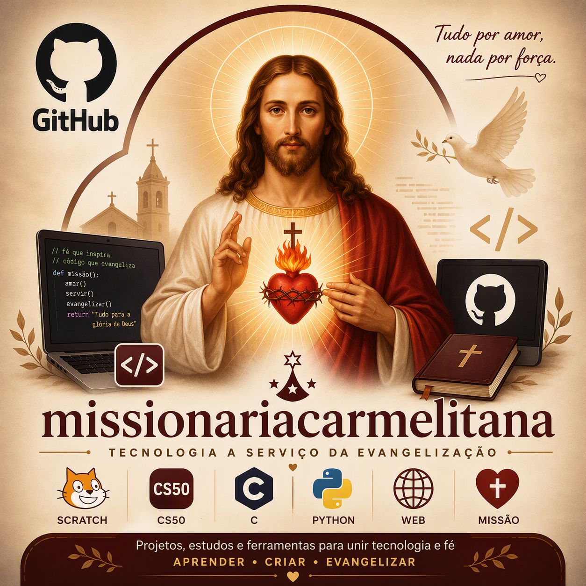

# Missionária Carmelitana

Repositório dedicado aos meus projetos de evangelização digital no mundo da tecnologia.

## Objetivo

Utilizar a tecnologia como instrumento de formação, comunicação e evangelização, documentando projetos desenvolvidos ao longo da minha jornada acadêmica e pessoal.

## Projetos

### Scratch (CS50)

Primeiro projeto desenvolvido durante o curso CS50 em 2022/2023

#### Aprendizados

- Lógica de programação
- Eventos
- Condicionais
- Laços de repetição
- Organização de projetos

## Tecnologias

- Scratch

## Autor

Ana Paula da Silva Souza
